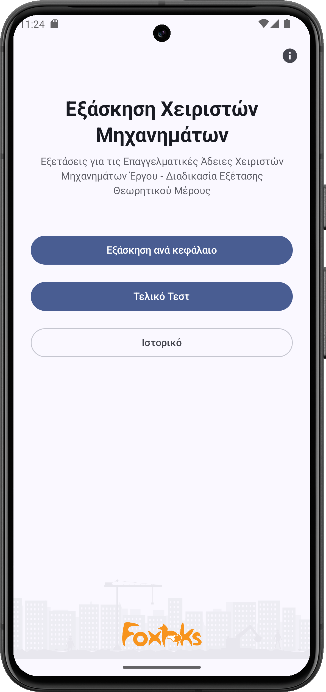
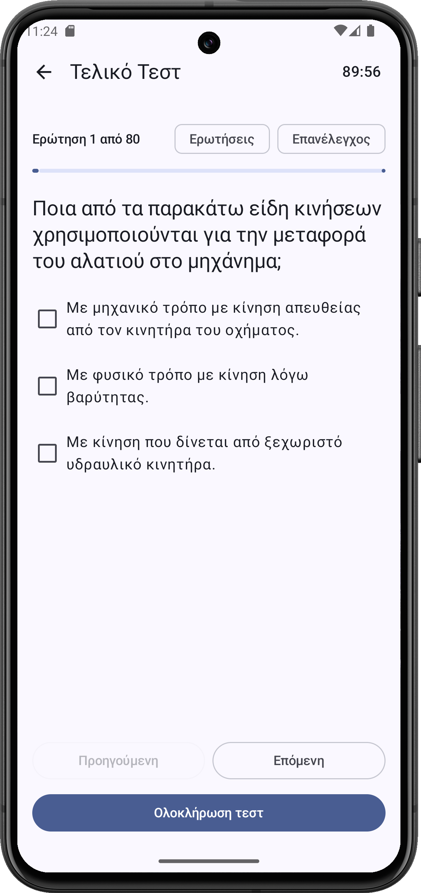
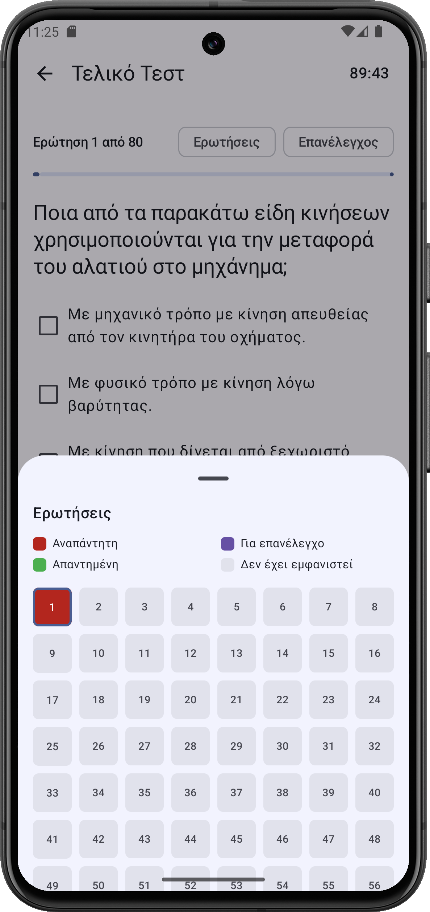

# Heavy Machinery Operator — Exam Prep

[🇬🇧 English](README.md) | [🇬🇷 Ελληνικά](README.el.md)


Android app · Kotlin & Jetpack Compose · Practice app for the Greek heavy machinery operator ("χειριστής μηχανημάτων έργου") professional license exam.

<!-- Once published, replace PLAY_STORE_URL below with the real link. -->
<p align="center">
  <a href="PLAY_STORE_URL">
    
  </a>
</p>

## Screenshots

<p align="center">
  
  
  
</p>

## About the app

This app was built to help candidates for the Greek heavy machinery operator license prepare for the theoretical certification exam. You can practice chapter by chapter, learning the correct answers as you go, and once you feel ready, test your knowledge in a full simulation of the real exam, with a timer and the same scoring conditions.

## Features

**Practice by chapter** — 15 syllabus chapters, immediate feedback on every question, with the correct answer shown when needed.

**Final Exam** — a real exam simulation: 80 questions with a fixed (non-proportional) per-chapter distribution drawn from a bank of 448 questions, a 90-minute timer, and a 75% (60/80) pass threshold. Single- and multiple-correct-answer questions.

**Review & navigation** — flag questions "for review" during the exam, plus a full overview of every question (a color-coded grid: answered / unanswered / flagged for review / not yet seen) for quick navigation.

**Resilience** — the exam is never lost if the app goes to the background, the screen locks, or the process is killed by the OS; progress and the timer resume correctly when you return.

**History** — a record of past exam attempts (date, score, pass/fail), stored locally on the device.

## Tech stack

- Kotlin
- Jetpack Compose + Material 3
- Navigation-Compose
- kotlinx.serialization (parsing the question bank from bundled JSON)
- Room (local result history)
- ViewModel + StateFlow (no external DI framework)
- minSdk 24 (Android 7.0)

## Project structure

```
app/src/main/
 ├── assets/                    questions.json, exam_config.json — the question bank
 ├── java/.../
 │    ├── data/                 models, repositories (questions, config, history, exam state)
 │    │    └── local/           Room: entities, DAO, Database
 │    ├── ui/
 │    │    ├── home/            HomeScreen + loading/splash
 │    │    ├── chapterlist/     chapter list
 │    │    ├── practice/        practice by chapter
 │    │    ├── exam/            final exam
 │    │    ├── results/         exam results
 │    │    ├── history/         attempt history
 │    │    ├── about/           about the app
 │    │    └── common/          shared components (OptionRow, etc.)
 │    └── navigation/           NavGraph
 └── res/                       icon, artwork, strings.xml
```

## Build & run

```
git clone https://github.com/XaplanterisNikos/XeiristisExamQuiz.git
```

Open the folder in Android Studio, let Gradle sync, then hit Run on an emulator or a real device (Android 7.0+). No API key or network connection is needed — the question bank is bundled locally with the app.

## About the creator

The app was built by Nikos Xaplanteris. Before becoming a developer, I worked as a heavy machinery operator myself — I sat these exact exams, and I know first-hand how much a good practice tool helps. I later studied Computer Science and now work as a software developer. This app is a combination of both worlds.

<!-- Add email / LinkedIn here if you want them shown in the README -->

## License

This project is distributed under the [MIT](LICENSE) license.
